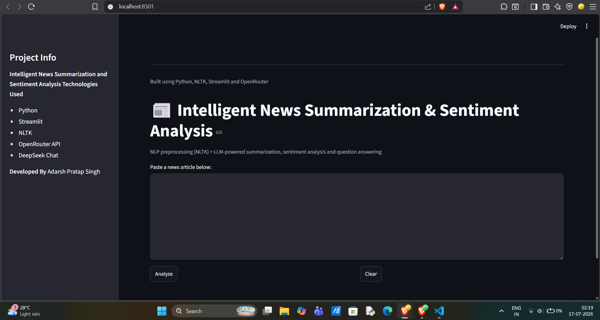
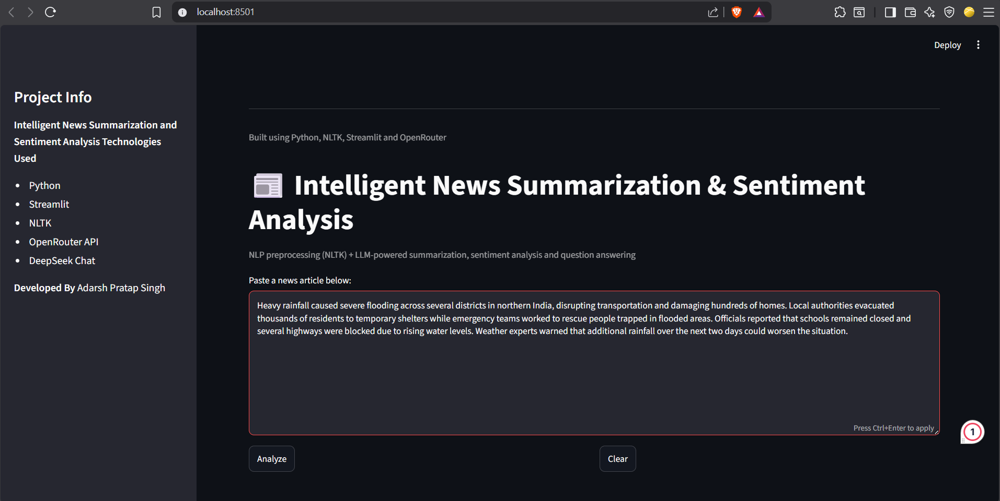
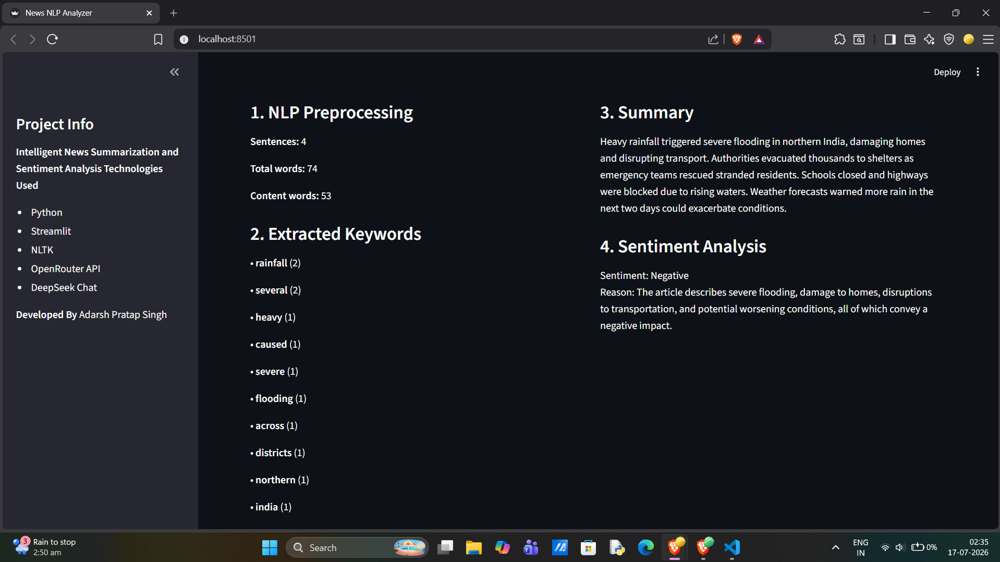
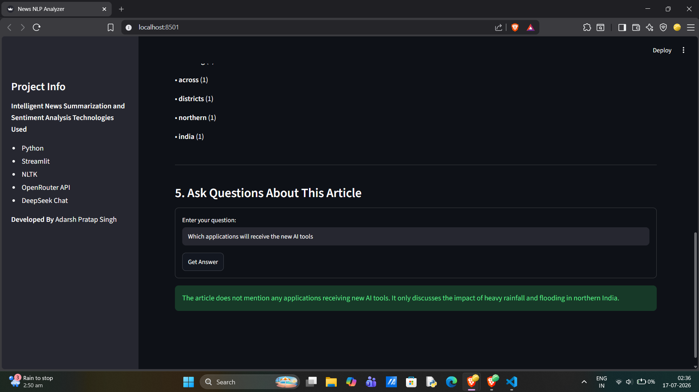
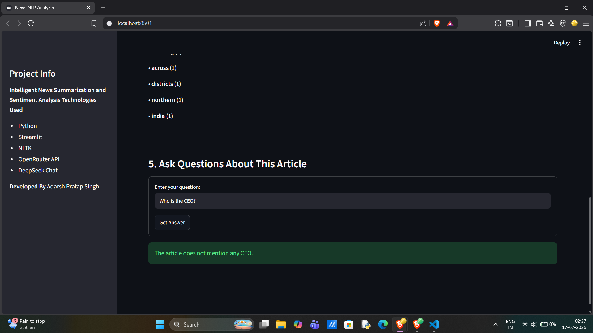

# 📰 Intelligent News Summarization and Sentiment Analysis System


An interactive NLP-powered web application that combines **classical Natural Language Processing (NLTK)** with **Large Language Models (LLMs)** to analyze news articles.

An interactive NLP-powered web application that performs classical Natural Language Processing (NLP) tasks alongside Large Language Model (LLM) capabilities to analyze news articles.

The application combines traditional NLP techniques for preprocessing and keyword extraction with prompt-engineered LLM workflows for abstractive summarization, sentiment analysis, and grounded question answering.

Built using **Python**, **Streamlit**, **NLTK**, and **OpenRouter (DeepSeek Chat)**.

---

## ✨ Features

- Classical NLP preprocessing using NLTK
- Frequency-based keyword extraction
- AI-generated concise news summaries
- News sentiment classification
- Context-aware question answering
- Interactive Streamlit interface
- Graceful handling of missing API keys
- Clean and modular architecture

---
## Why this project?

Many news summarization applications rely entirely on Large Language Models. This project intentionally combines **classical NLP** with **LLM-based reasoning** to demonstrate both traditional Natural Language Processing techniques and modern prompt engineering.

The preprocessing and keyword extraction pipeline is implemented using **NLTK**, making the workflow transparent and explainable. Higher-level language understanding tasks—including summarization, sentiment analysis, and question answering—are delegated to an LLM through carefully designed prompts that encourage concise, factual, and grounded responses.

## Demo

### Input
Paste any news article into the application.

### Output

- Sentence Count
- Word Count
- Keyword Extraction
- AI Summary
- Sentiment Analysis
- Question Answering

---

## Project Architecture

```text
                News Article
                      │
                      ▼
         NLP Preprocessing (NLTK)
         ├── Sentence Tokenization
         ├── Word Tokenization
         ├── Stopword Removal
         └── Text Cleaning
                      │
                      ▼
           Keyword Extraction
                      │
                      ▼
               OpenRouter API
                      │
      ┌───────────────┼───────────────┐
      ▼               ▼               ▼
  Summary        Sentiment         Q&A
                      │
                      ▼
               Streamlit Dashboard
```

---

## Repository Structure
NEWS_SUMMARIZER
│
├── screenshots/
│   ├── home.png
│   ├── input.png
│   ├── analysis.png
│   ├── qa.png
│   └── grounding.png
│
├── app.py
├── requirements.txt
├── README.md
├── .gitignore
├── LICENSE
└── .env (local only)


## Tech Stack

| Category | Technology |
|----------|------------|
| Language | Python |
| UI | Streamlit |
| NLP | NLTK |
| LLM | DeepSeek Chat |
| API Provider | OpenRouter |
| Prompt Engineering | Custom Prompts |

---

## Installation

Clone the repository

```bash
git clone https://github.com/<your-username>/<repository>.git
```

Move into the project

```bash
cd <repository>
```

Install dependencies

```bash
pip install -r requirements.txt
```

Download NLTK resources

```bash
python -c "import nltk; nltk.download('punkt'); nltk.download('punkt_tab'); nltk.download('stopwords')"
```

Create a `.env` file

```env
OPENROUTER_API_KEY=your_api_key
```

Run the application

```bash
streamlit run app.py
```

---

## How It Works

### 1. NLP Preprocessing

The application first performs classical NLP preprocessing without using any LLM.

This includes:

- Sentence Tokenization
- Word Tokenization
- Stopword Removal
- Text Cleaning

---

### 2. Keyword Extraction

Keywords are extracted using frequency analysis over the cleaned text.

This demonstrates a traditional NLP approach instead of relying entirely on generative AI.

---

### 3. AI Summarization

A carefully engineered prompt instructs the LLM to produce:

- 3–4 concise sentences
- Fact-based summaries
- No hallucinated information

---

### 4. Sentiment Analysis

The model classifies the article into exactly one category:

- Positive
- Negative
- Neutral

along with a concise justification.

---

### 5. Question Answering

Questions are answered strictly using the provided article.

If the requested information is unavailable, the model is explicitly instructed to refuse rather than hallucinate.

---

## Prompt Engineering

The project intentionally uses different prompts for different tasks.

| Task | Prompt Strategy |
|------|-----------------|
| Summary | Fact-only summarization |
| Sentiment | Fixed output format |
| Question Answering | Grounded responses with hallucination prevention |

---

## Project Structure

```text
.
├── app.py
├── requirements.txt
├── .env
├── README.md
└── .gitignore
```

---

## Future Improvements

- Support direct news article URLs
- Upload TXT and PDF files
- Multi-language summarization
- Named Entity Recognition (NER)
- Topic classification
- Keyword visualization
- Export analysis as PDF
- History of analyzed articles
- Support multiple LLM providers

---
## Screenshots

### Home



---

### Article Input



---

### Analysis



---

### Question Answering



---

### Grounded Responses



## Author

**Adarsh Pratap Singh**

B.Tech 

Ajay Kumar Garg Engineering College

---

## License

This project is intended for educational and learning purposes.